# Results table

| Method | T domain | Used data in training | Plot | 3D plot |
| --- | --- | --- | --- | --- |
| RNG | $$ \pi / 2 $$ | - | 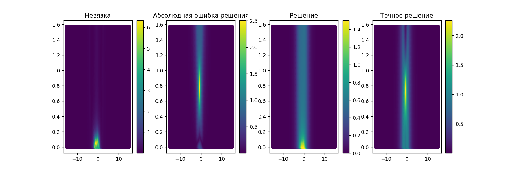 | 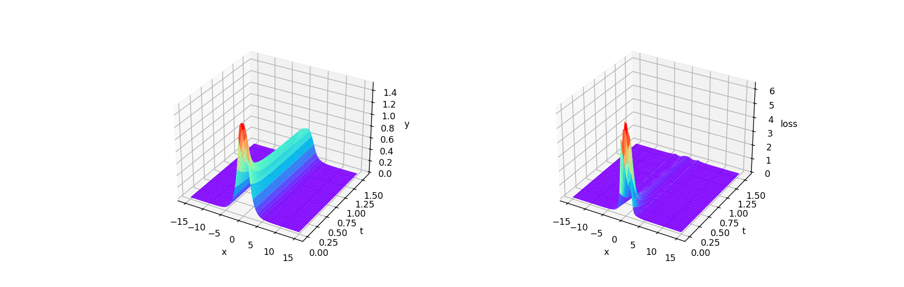 |
| RNG | $$ 4 \pi $$ | - | 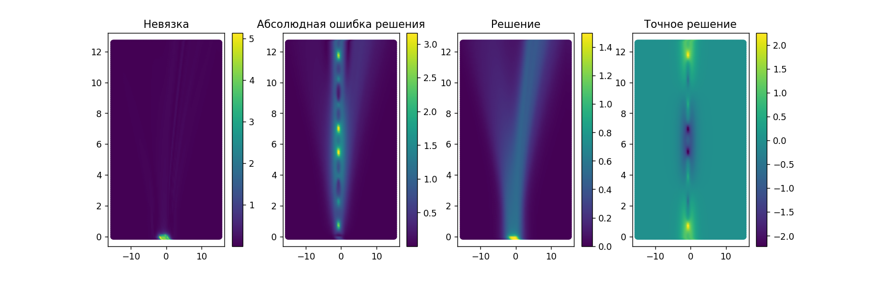 | 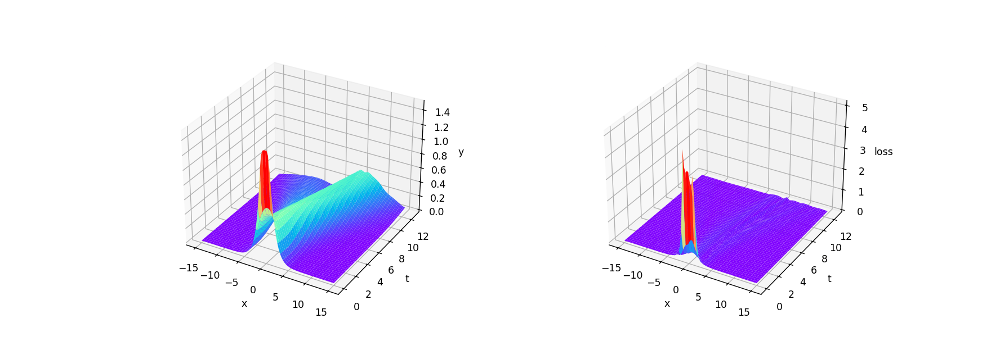 |
| RAD | $$ \pi / 2 $$ | - | 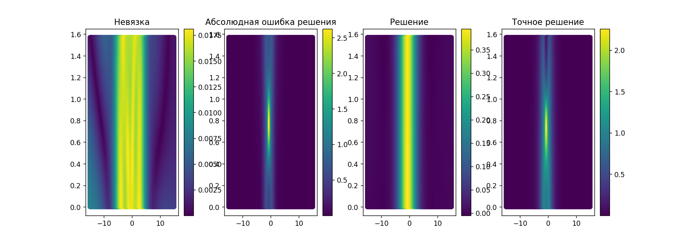 | 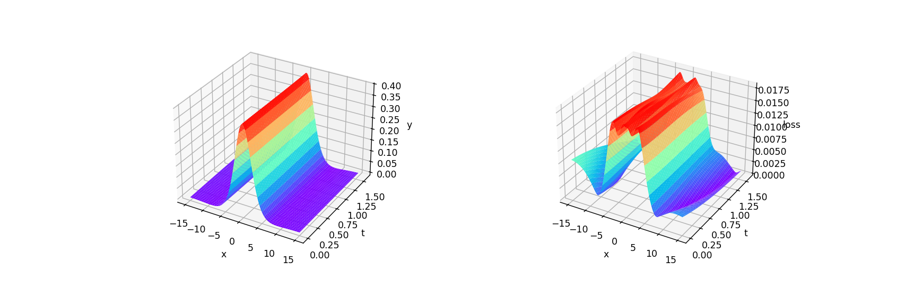 |
| RAD | $$ 4 \pi $$ | - | 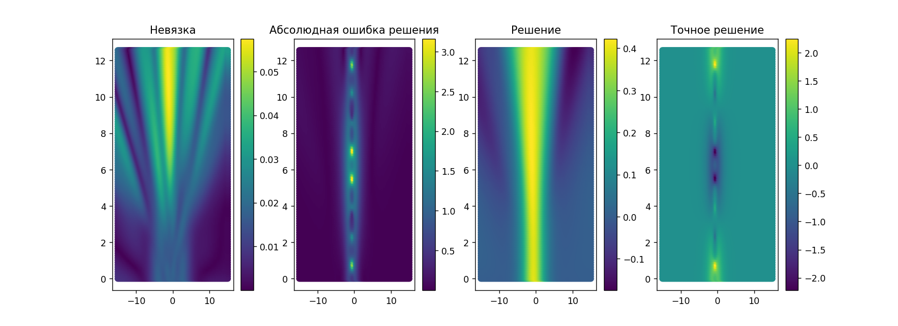 | 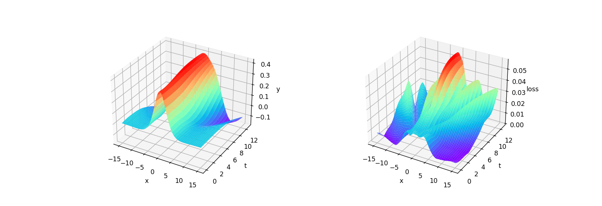 |
| RNG+data | $$ \pi / 2 $$ | + | 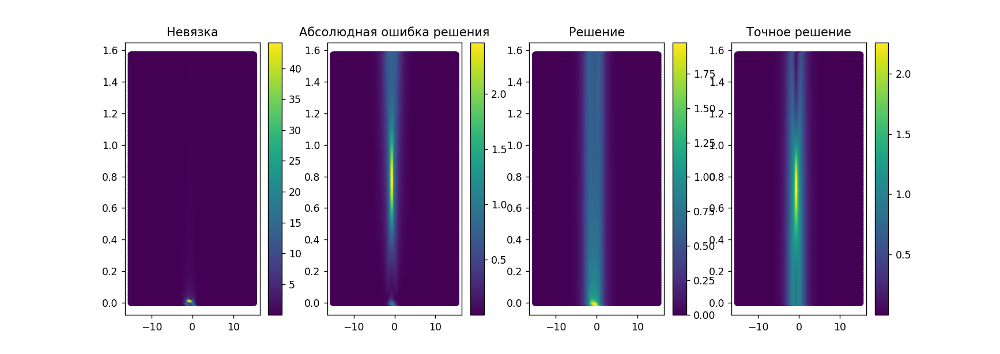 | 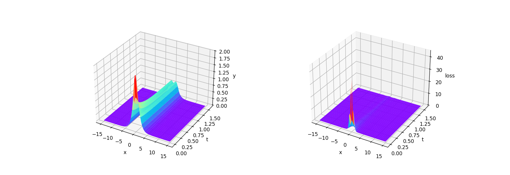 |
| RNG+data | $$ 4 \pi $$ | + | 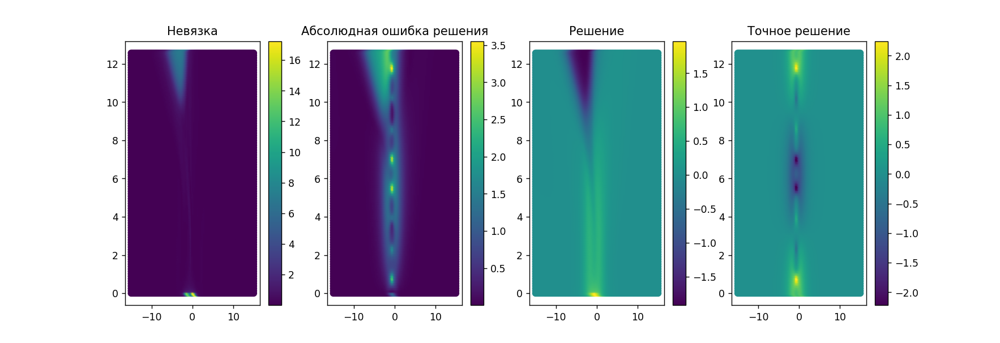 | 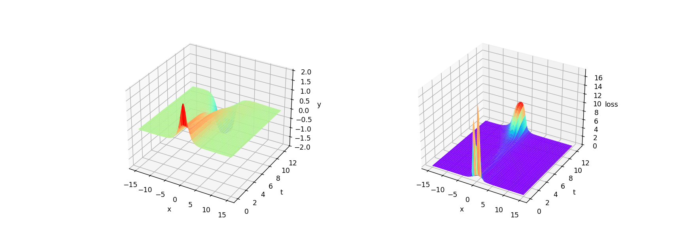 |
| RAD+data | $$ \pi / 2 $$ | + | 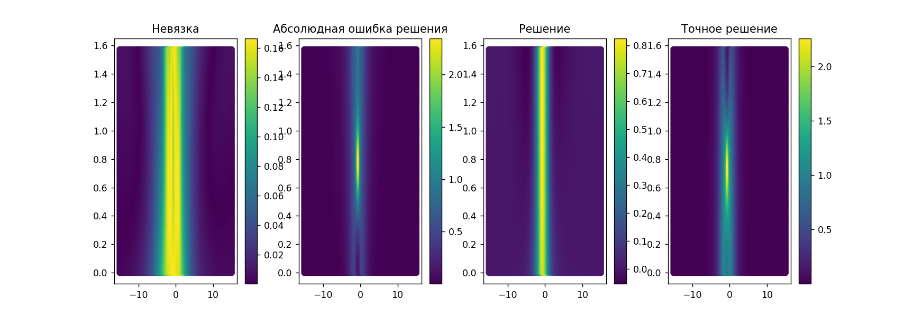 | 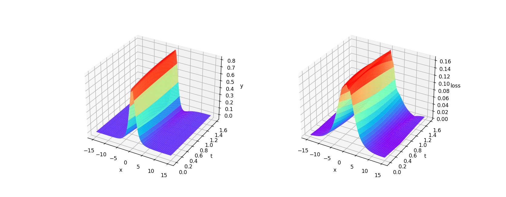 |
| RAD+data | $$ 4 \pi $$ | + | 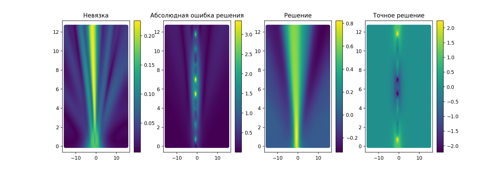 | 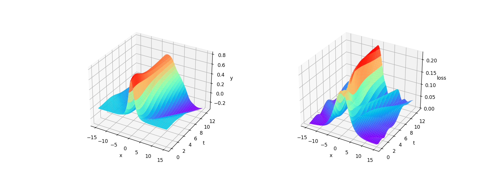 |
| RNG+data+fte | $$ \pi / 2 $$ | - | 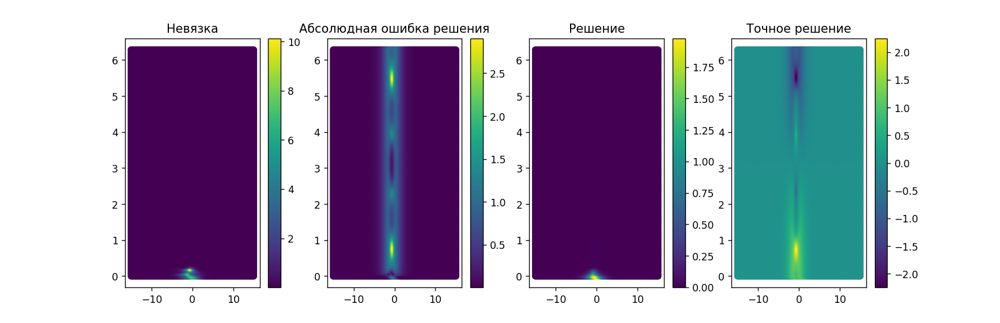 | 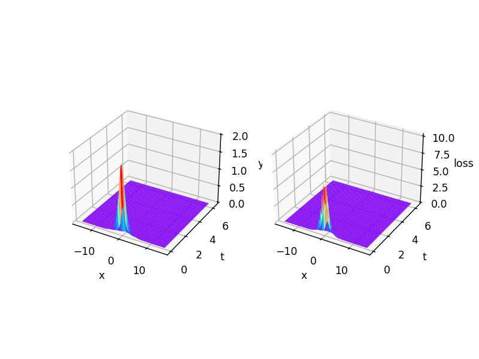 |
| RNG+data+fte | $$ 4 \pi $$ | - | 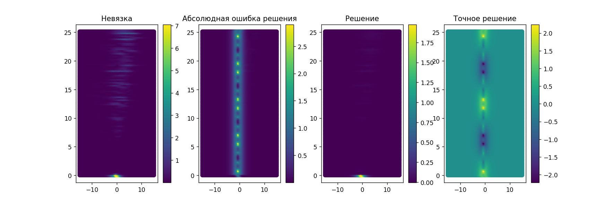 | 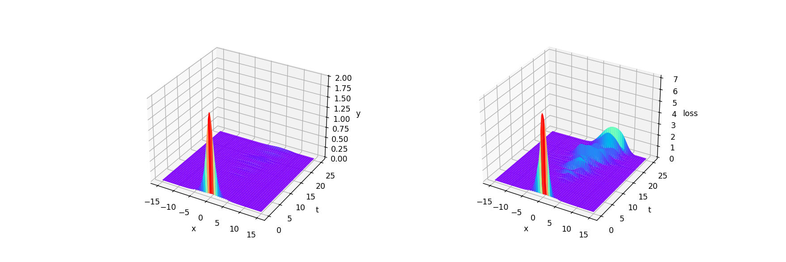 |
| RAD+data+fte | $$ \pi / 2 $$ | - | 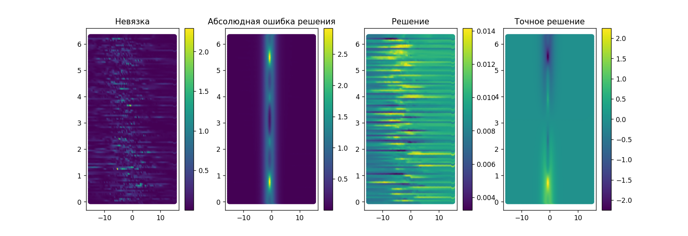 | 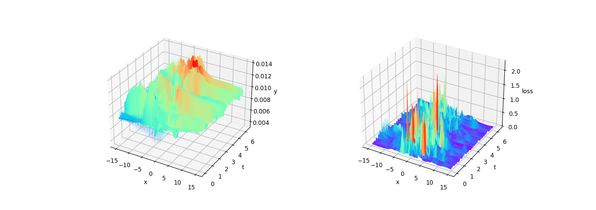 |
| RAD+data+fte | $$ 4 \pi $$ | - | 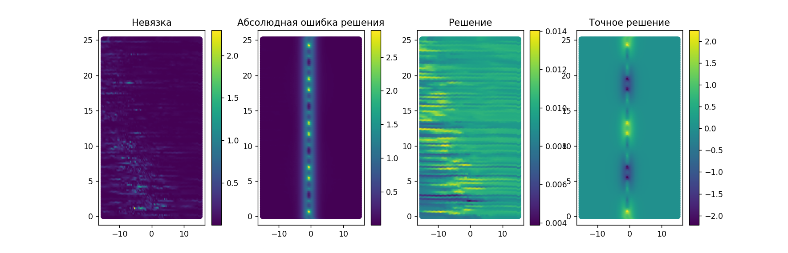 | 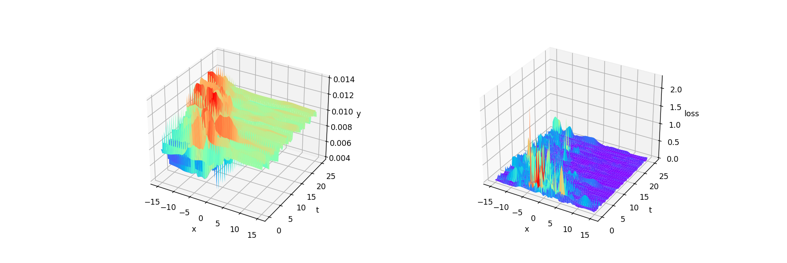 |
| RAD+fte | $$ \pi / 2 $$ | - | 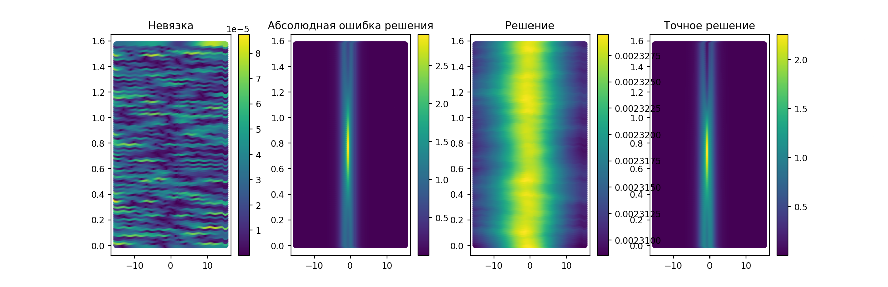 | 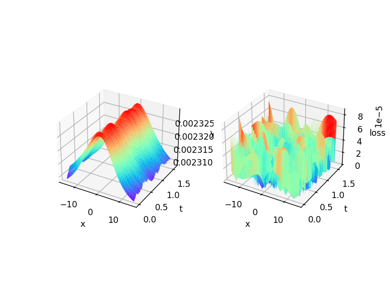 |
| RAD+fte | $$ 4 \pi $$ | - | 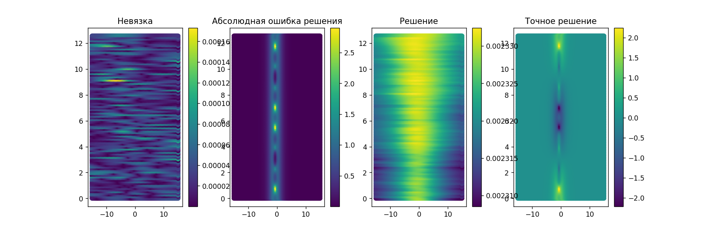 | 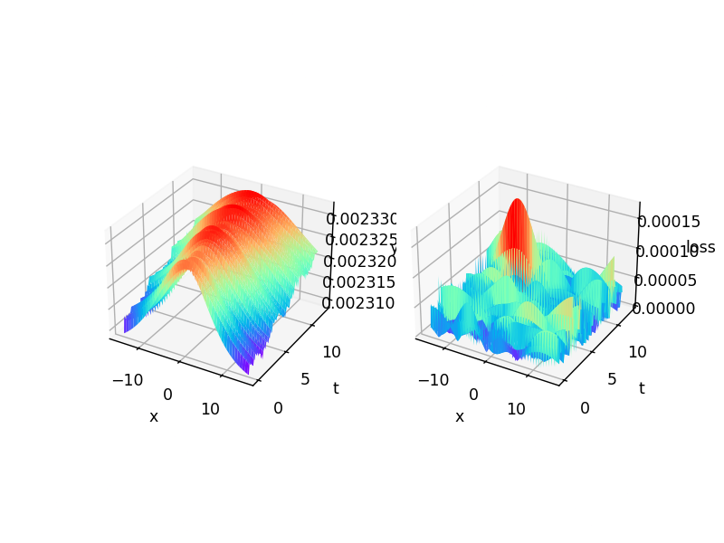 |